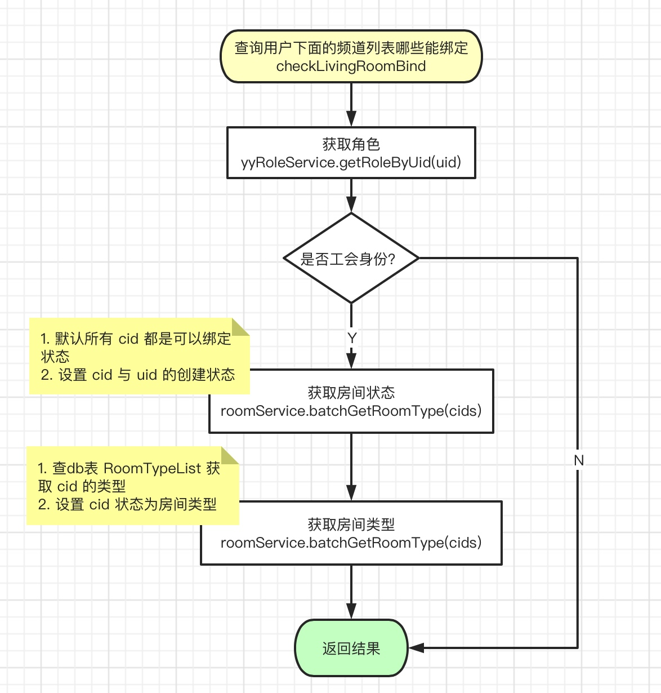

# manager

该服务主要有两个功能：
1. 对外提供两个接口
2. 监听 kafka 主题`Lpfm2ChannelBindedNotify_60035`，处理 sid 与 uid 的解绑/绑定关系

## 提供的 RPC 接口
1. 查询用户下面的频道（房间）列表哪些能绑定，对应接口方法为`RoomBindYrpcService#checkLivingRoomBind`，流程如下：

2. 查询频道类型，对应的接口方法为：``，流程如下：

## Kafka 监听用户、频道解绑/绑定事件

